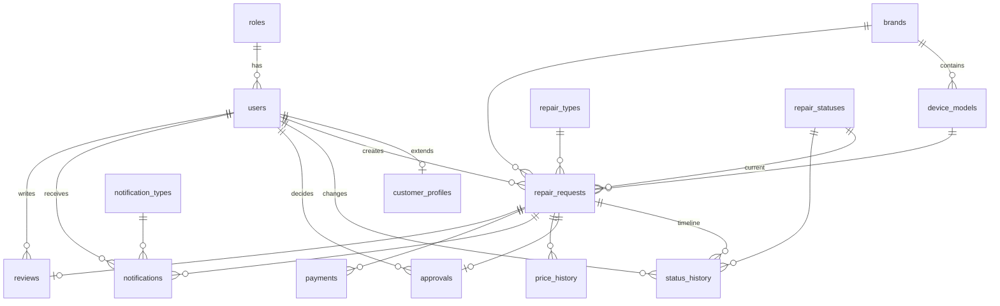

# Veritabanı Dokümantasyonu

Telefon ve bilgisayar teknik servis takip sistemi için PostgreSQL veritabanı şeması ve örnek veri seti. React frontend uygulamasındaki veri modeliyle eşleşecek şekilde tasarlanmıştır.

| Dosya | Açıklama |
|-------|----------|
| [`schema.sql`](./schema.sql) | Tablolar, ilişkiler, indeksler, trigger'lar ve temel sözlük verileri |
| [`sample_data.sql`](./sample_data.sql) | Geliştirme ve test için örnek kullanıcı, tamir kaydı ve ilişkili veriler |

---

## İçindekiler

- [Genel Bakış](#genel-bakış)
- [Frontend Alan Eşlemesi](#frontend-alan-eşlemesi)
- [Gereksinimler](#gereksinimler)
- [Kurulum](#kurulum)
- [İş Akışı](#iş-akışı)
- [ER Diyagramı](#er-diyagramı)
- [Tablolar](#tablolar)
- [Foreign Key İlişkileri](#foreign-key-ilişkileri)
- [schema.sql İçeriği](#schemasql-içeriği)
- [sample_data.sql İçeriği](#sample_datasql-içeriği)
- [Demo Hesaplar](#demo-hesaplar)
- [Örnek Sorgular](#örnek-sorgular)

---

## Genel Bakış

Bu veritabanı, React frontend ile çalışan teknik servis uygulamasının backend katmanı için tasarlanmıştır. Sistemde **Admin** ve **Müşteri** rolleri bulunur.

### Temel özellikler

- Referans numarası ile cihaz sorgulama (`CIH-YYYYMMDD-0001` formatı)
- Kayıt başına müşteri şifresi (referans + şifre ile giriş)
- Fiyat belirleme ve fiyat geçmişi
- Müşteri onayı / reddi
- Durum geçmişi (timeline)
- Bildirim sistemi
- Ödeme kayıtları
- Yorum ve değerlendirme (1–5 puan)

### Tasarım prensipleri

- **Frontend uyumu:** `repair_requests` tablosu React'teki cihaz kaydı nesnesiyle doğrudan eşleşir
- **Normalize yapı:** Marka, durum, arıza tipi gibi tekrarlayan veriler sözlük tablolarında tutulur (isteğe bağlı FK)
- **UUID anahtarlar:** Kullanıcı ve tamir kayıtları için güvenli kimlikler
- **Güncel durum + geçmiş:** `current_status_id` hızlı sorgu için; `status_history` tam timeline için
- **Snapshot kayıtlar:** Onay anındaki fiyat `approvals.price_at_decision` alanında saklanır

---

## Frontend Alan Eşlemesi

API katmanı kurulurken React alanları veritabanına şöyle bağlanır:

| React (frontend) | PostgreSQL | Not |
|------------------|------------|-----|
| `referansNo` | `repair_requests.referans_no` | `CIH-20260608-0001` |
| `adSoyad` | `repair_requests.ad_soyad` | |
| `telefon` | `repair_requests.telefon` | |
| `email` | `repair_requests.email` | |
| `sifre` | `repair_requests.customer_password_hash` | bcrypt ile hash |
| `cihazTuru` | `repair_requests.cihaz_turu` | `Telefon`, `PC`, `Tablet` |
| `marka` | `repair_requests.marka` | |
| `model` | `repair_requests.model` | |
| `arizaNot` | `repair_requests.ariza_not` | |
| `islem` | `repair_requests.islem` | |
| `fiyat` | `repair_requests.fiyat` | |
| `durum` | `repair_statuses.name` | `current_status_id` üzerinden |
| `history[].step` | `status_history.step` | |
| `history[].date` | `status_history.recorded_at` | |

**Admin girişi:** `users.username` + `users.password_hash` (örn. `admin` / `admin123`)

**Müşteri girişi:** `referans_no` + `customer_password_hash` (kayıt sırasında belirlenen şifre)

> SQL dosyalarındaki `--` ile başlayan açıklama satırları yalnızca dokümantasyondur; PostgreSQL bunları çalıştırmaz, React kodunu etkilemez.

---

## Gereksinimler

- PostgreSQL **14+** (önerilen)
- `pgcrypto` extension (UUID üretimi için — `schema.sql` otomatik etkinleştirir)

---

## Kurulum

### 1. Veritabanını oluştur

```sql
CREATE DATABASE repair_system
    ENCODING 'UTF8';
```

> Alternatif isim: `tamir_sistemi` — geliştirme ve production ortamında aynı ismi kullanın.

### 2. Şemayı yükle

```bash
psql -U postgres -d repair_system -f schema.sql
```

### 3. Örnek veriyi yükle (isteğe bağlı)

```bash
psql -U postgres -d repair_system -f sample_data.sql
```

> `sample_data.sql` yalnızca `schema.sql` çalıştırıldıktan **sonra** yüklenmelidir.

### Windows (pgAdmin)

1. `repair_system` veritabanını oluşturun
2. Query Tool'da önce `schema.sql`, ardından `sample_data.sql` dosyasını çalıştırın

---

## İş Akışı

Ana tamir süreci aşağıdaki durumlar üzerinden ilerler:

```
Cihaz Alındı → Beklemede → Onay Bekliyor → Onaylandı → Tamirde → Hazır → Teslim Edildi
                              │
                              └──→ Reddedildi (son durum)
```

Timeline'da ayrıca `İnceleniyor` adımı gösterilebilir (frontend ile uyumlu).

| Kod | Durum | Terminal |
|-----|-------|----------|
| `cihaz_alindi` | Cihaz Alındı | Hayır |
| `beklemede` | Beklemede | Hayır |
| `inceleniyor` | İnceleniyor | Hayır |
| `onay_bekliyor` | Onay Bekliyor | Hayır |
| `onaylandi` | Onaylandı | Hayır |
| `reddedildi` | Reddedildi | **Evet** |
| `tamirde` | Tamirde | Hayır |
| `hazir` | Hazır | Hayır |
| `teslim_edildi` | Teslim Edildi | **Evet** |

Her adım `status_history` tablosuna `step` ve `recorded_at` ile yazılır.

---

## ER Diyagramı



---

## Tablolar

### Kimlik ve kullanıcı

| Tablo | Açıklama |
|-------|----------|
| `roles` | Sistem rolleri (`admin`, `customer`) |
| `users` | Tüm kullanıcılar; `username`, e-posta veya telefon |
| `customer_profiles` | Müşteriye özel adres ve not bilgileri |

### Sözlük tabloları

| Tablo | Açıklama |
|-------|----------|
| `brands` | Cihaz markaları (Apple, Samsung, HP…) |
| `device_models` | Markaya bağlı modeller; `device_type`: Telefon, PC, Tablet |
| `repair_types` | Arıza / işlem tipleri (ekran kırık, pil sorunu…) |
| `repair_statuses` | Workflow durumları |
| `notification_types` | Bildirim kategorileri |

### İş mantığı

| Tablo | Açıklama |
|-------|----------|
| `repair_requests` | **Ana varlık** — referans no, müşteri, cihaz, fiyat, güncel durum |
| `status_history` | Durum geçmişi / timeline (`step`, `recorded_at`) |
| `approvals` | Müşteri onay veya red kararı |
| `price_history` | Admin fiyat değişiklik geçmişi |

### Yan hizmetler

| Tablo | Açıklama |
|-------|----------|
| `notifications` | Kullanıcı bildirimleri (okundu / okunmadı) |
| `payments` | Ödeme kayıtları (nakit, kart, havale…) |
| `reviews` | Tamir sonrası puan ve yorum (kayıt başına 1 adet) |

### `repair_requests` önemli alanlar

| Alan | Açıklama |
|------|----------|
| `referans_no` | Benzersiz referans numarası (`CIH-YYYYMMDD-NNNN`) |
| `ad_soyad` | Müşteri adı soyadı |
| `telefon` | İletişim telefonu |
| `email` | E-posta (opsiyonel) |
| `customer_password_hash` | Müşteri sorgulama şifresi (bcrypt) |
| `cihaz_turu` | `Telefon`, `PC` veya `Tablet` |
| `marka` | Cihaz markası |
| `model` | Cihaz modeli |
| `ariza_not` | Müşterinin bildirdiği arıza |
| `islem` | Admin tarafından tanımlanan işlem |
| `fiyat` | Güncel fiyat teklifi |
| `current_status_id` | Güncel durum (FK) |
| `final_price` | Kesinleşen fiyat (teslim öncesi) |
| `assigned_admin_id` | İşlemi yürüten admin |

> `brand_id`, `device_model_id`, `repair_type_id`, `customer_id` alanları isteğe bağlı normalizasyon içindir.

---

## Foreign Key İlişkileri

```
users.role_id                      → roles.id
customer_profiles.user_id          → users.id          (ON DELETE CASCADE)

device_models.brand_id             → brands.id

repair_requests.customer_id        → users.id
repair_requests.brand_id           → brands.id
repair_requests.device_model_id    → device_models.id
repair_requests.repair_type_id     → repair_types.id
repair_requests.current_status_id  → repair_statuses.id
repair_requests.assigned_admin_id  → users.id

status_history.repair_request_id   → repair_requests.id  (CASCADE)
status_history.status_id           → repair_statuses.id
status_history.changed_by_id       → users.id

approvals.repair_request_id        → repair_requests.id  (CASCADE)
approvals.customer_id              → users.id

price_history.repair_request_id    → repair_requests.id  (CASCADE)
price_history.changed_by_id        → users.id

notifications.user_id              → users.id            (CASCADE)
notifications.repair_request_id    → repair_requests.id  (SET NULL)
notifications.notification_type_id → notification_types.id

payments.repair_request_id         → repair_requests.id  (CASCADE)
payments.recorded_by_id            → users.id

reviews.repair_request_id          → repair_requests.id  (CASCADE, UNIQUE)
reviews.customer_id                → users.id
```

---

## schema.sql İçeriği

`schema.sql` dosyası şunları oluşturur:

### Yapısal bileşenler

- **15 tablo** (10 iş + 5 sözlük)
- **Foreign key** kısıtlamaları
- **CHECK** kısıtlamaları (referans formatı, fiyat ≥ 0, rating 1–5, cihaz türü vb.)
- **İndeksler** — referans no, telefon, durum, okunmamış bildirim
- **`set_updated_at()` trigger** — `users`, `customer_profiles`, `repair_requests`, `payments`, `reviews` tablolarında `updated_at` otomatik güncellenir

### Otomatik yüklenen sözlük verileri

| Tablo | Kayıt |
|-------|-------|
| `roles` | admin, customer |
| `repair_statuses` | 9 durum |
| `repair_types` | 9 arıza tipi |
| `brands` | 10 marka |
| `notification_types` | 7 bildirim tipi |

### Referans numarası formatı

```
CIH-YYYYMMDD-NNNN
Örnek: CIH-20260608-0001
```

PostgreSQL `referans_no_format` CHECK kısıtı bu formatı zorunlu kılar.

---

## sample_data.sql İçeriği

Geliştirme ve demo testleri için gerçekçi örnek veriler içerir. Tüm UUID'ler **sabit** tutulmuştur; API geliştirirken doğrudan referans verilebilir.

### Eklenen veriler

| Varlık | Adet |
|--------|------|
| Cihaz modelleri | 8 |
| Kullanıcılar | 4 (1 admin + 3 müşteri) |
| Müşteri profilleri | 3 |
| Tamir kayıtları | 5 |
| Durum geçmişi | 20+ kayıt |
| Onay / red | 4 |
| Fiyat geçmişi | 6 |
| Bildirimler | 6 |
| Ödemeler | 2 |
| Yorumlar | 1 |

### Örnek tamir kayıtları

| Referans No | Müşteri | Cihaz | Durum | Not |
|-------------|---------|-------|-------|-----|
| `CIH-20260520-0001` | Ahmet Yılmaz | Telefon · Apple iPhone 11 | Teslim Edildi | Ödeme tamamlandı, 5 yıldız yorum |
| `CIH-20260605-0001` | Ayşe Demir | Telefon · Samsung Galaxy S21 | Onay Bekliyor | Müşteri onayı bekleniyor |
| `CIH-20260601-0001` | Mehmet Kaya | PC · Lenovo ThinkPad E14 | Tamirde | Onaylandı, tamir devam ediyor |
| `CIH-20260528-0001` | Ahmet Yılmaz | Telefon · Xiaomi Redmi Note 12 | Reddedildi | Müşteri fiyatı yüksek buldu |
| `CIH-20260603-0001` | Ayşe Demir | PC · HP Pavilion 15 | Hazır | Teslim bekliyor, ödeme pending |

### Sabit UUID referansları

```
Admin:     a0000000-0000-4000-8000-000000000001
Müşteri 1: b0000000-0000-4000-8000-000000000001  (Ahmet Yılmaz)
Müşteri 2: b0000000-0000-4000-8000-000000000002  (Ayşe Demir)
Müşteri 3: b0000000-0000-4000-8000-000000000003  (Mehmet Kaya)

Tamir 1–5: c0000000-0000-4000-8000-000000000001 … 000005
```

---

## Demo Hesaplar

`sample_data.sql` yüklendikten sonra aşağıdaki bilgilerle test yapılabilir.

### Admin paneli

| Alan | Değer |
|------|-------|
| Kullanıcı adı | `admin` |
| Şifre | `admin123` |

### Müşteri takip girişi

Referans numarası + kayıt şifresi kullanılır. Tüm örnek kayıtların şifresi: **`1234`**

| Referans No | Durum | Şifre |
|-------------|-------|-------|
| `CIH-20260605-0001` | Onay Bekliyor | `1234` |
| `CIH-20260601-0001` | Tamirde | `1234` |
| `CIH-20260520-0001` | Teslim Edildi | `1234` |

---

## Örnek Sorgular

### Referans numarası ile tamir detayı

```sql
SELECT
    rr.referans_no,
    rs.name     AS durum,
    rr.ad_soyad AS musteri,
    rr.cihaz_turu,
    rr.marka,
    rr.model,
    rr.ariza_not,
    rr.islem,
    rr.fiyat,
    rr.final_price
FROM repair_requests rr
JOIN repair_statuses rs ON rs.id = rr.current_status_id
WHERE rr.referans_no = 'CIH-20260520-0001';
```

### Durum geçmişi (timeline)

```sql
SELECT
    sh.step,
    sh.recorded_at,
    u.full_name AS degistiren,
    sh.note
FROM status_history sh
LEFT JOIN users u ON u.id = sh.changed_by_id
WHERE sh.repair_request_id = 'c0000000-0000-4000-8000-000000000001'
ORDER BY sh.recorded_at;
```

### Okunmamış bildirimler

```sql
SELECT
    n.title,
    n.message,
    nt.name AS tip,
    n.created_at
FROM notifications n
JOIN notification_types nt ON nt.id = n.notification_type_id
WHERE n.user_id = 'b0000000-0000-4000-8000-000000000002'
  AND n.is_read = FALSE
ORDER BY n.created_at DESC;
```

### Admin paneli — duruma göre kayıt sayısı

```sql
SELECT
    rs.name  AS durum,
    COUNT(*) AS adet
FROM repair_requests rr
JOIN repair_statuses rs ON rs.id = rr.current_status_id
GROUP BY rs.sort_order, rs.name
ORDER BY rs.sort_order;
```

---

## Dosya Yapısı

```
database/
├── schema.sql        # Veritabanı şeması + temel sözlük verileri
├── sample_data.sql   # Örnek kullanıcı ve tamir verileri
└── DATABASE.md       # Bu dokümantasyon
```

---

## Lisans ve Katkı

Bu şema projenin bir parçasıdır. Değişiklik yaparken foreign key sırasına dikkat edin: önce sözlük tabloları, sonra `users`, ardından `repair_requests` ve ilişkili tablolar.
